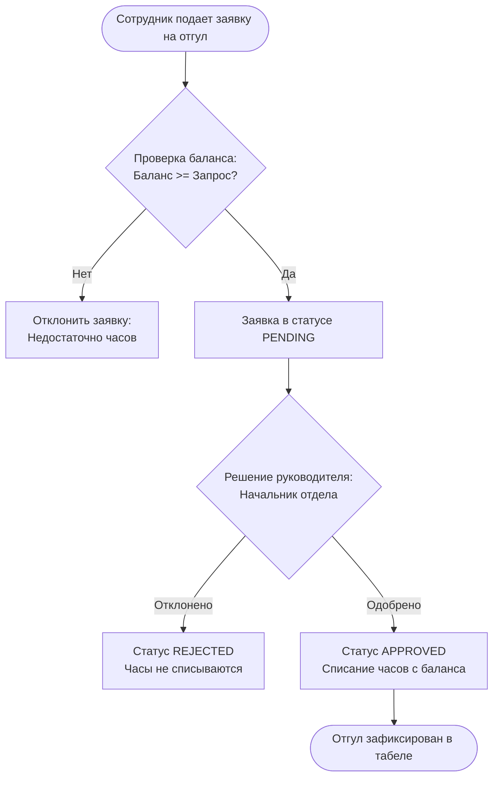

# 📋 Реестр отложенных функциональных модулей (Product Backlog)

В данном документе зафиксированы отложенные модули и функциональные расширения корпоративной системы **OvertimePro**. Для каждого модуля определены бизнес-цели, схемы данных, логика BPMN-процессов и планируемые интерфейсы.

---

## 📌 Навигация по модулям

1. [🏖 Модуль «Отгулы» (Time-Off & Compensatory Leave)](#1--модуль-отгулы-time-off--compensatory-leave)
2. [📅 Производственный календарь РК и контроль рабочего времени](#2--производственный-календарь-рк-и-контроль-рабочего-времени)
3. [👥 Механизм делегирования и замещения (Временный И.О.)](#3--механизм-делегирования-и-замещения-временный-ио)
4. [🌐 Поддержка распределенных команд и мультиязычных часовых поясов (Multi-Timezone)](#4--поддержка-распределенных-команд-и-часовых-поясов-multi-timezone)
5. [🔔 Web Push уведомления в браузере (PWA / Service Worker)](#5--web-push-уведомления-в-браузере-pwa--service-worker)

---

## 1. 🏖 Модуль «Отгулы» (Time-Off & Compensatory Leave)

* **Категория:** Управление рабочим временем / HR-процессы.
* **Приоритет:** Высокий.
* **Статус:** ⏸ В очереди реализации.

### Бизнес-цель
Предоставить сотрудникам возможность накапливать отработанные сверхурочные часы и использовать их для оформления отгулов (оплачиваемых дней/часов отдыха) вместо денежной компенсации.

### Логика процесса (BPMN)


### Модель данных (Схема БД)
```python
class TimeOff(Base):
    """Модель заявки на отгул за счет переработок."""
    __tablename__ = "time_offs"

    id: Mapped[int] = mapped_column(Integer, primary_key=True)
    user_id: Mapped[int] = mapped_column(Integer, ForeignKey("users.id"), nullable=False)
    date: Mapped[date] = mapped_column(Date, nullable=False)
    hours: Mapped[float] = mapped_column(Float, nullable=False)  # Например, 4ч или 8ч (полный день)
    description: Mapped[str] = mapped_column(String, nullable=False)
    status: Mapped[str] = mapped_column(String, default="PENDING")  # PENDING, APPROVED, REJECTED, CANCELLED
    approved_by_id: Mapped[int | None] = mapped_column(Integer, ForeignKey("users.id"), nullable=True)
    comment: Mapped[str | None] = mapped_column(String, nullable=True)
    created_at: Mapped[datetime] = mapped_column(DateTime(timezone=True), default=datetime.utcnow)
```

### Формула расчета баланса сотрудника
$$\text{Доступный баланс} = \sum \text{approved\_hours (Overtime APPROVED)} - \sum \text{hours (TimeOff APPROVED)}$$

### Планируемый интерфейс
* **Для сотрудника:** Виджет «Баланс отгулов» на главной странице дашборда и в Telegram Mini App, кнопка «Взять отгул», модальное окно выбора даты и количества часов.
* **Для руководителя:** Отдельная вкладка «Отгулы» на странице `/review` с кнопками одобрения/отклонения.

---

## 2. 📅 Производственный календарь РК и контроль рабочего времени

* **Категория:** Соответствие Трудовому кодексу (Compliance) / Автоматизация.
* **Приоритет:** Средний.
* **Статус:** ⏸ В очереди реализации.

### Бизнес-цель
Автоматизировать валидацию подачи заявок согласно официальному производственному календарю Республики Казахстан, исключить подачу переработок в стандартные рабочие часы и настроить умные напоминания.

### Требования к реализации
1. **Справочник производственного календаря**:
   * Таблица праздничных, выходных и перенесенных рабочих дней РК на текущий и следующий календарный год.
2. **Контроль стандартных рабочих часов**:
   * В будние дни (понедельник – пятница) стандартный рабочий день заканчивается в 19:00.
   * Подача переработки до 19:00 в будни требует обязательного подтверждения или блокируется системой (предупреждение: *«Указанное время пересекается с основным рабочим временем компании»*).
   * В выходные и официальные праздничные дни разрешена подача заявок на любое время суток.
3. **Вечерние Telegram-напоминания**:
   * Бот в 19:00 по будням отправляет ненавязчивое уведомление сотрудникам, у которых есть незавершенные смены или запланированные внеурочные работы.

---

## 3. 👥 Механизм делегирования и замещения (Временный И.О.)

* **Категория:** Бесперебойность процессов (Business Continuity).
* **Приоритет:** Средний.
* **Статус:** ⏸ В очереди реализации.

### Бизнес-цель
Предотвратить задержки в согласовании заявок во время отпусков, больничных и командировок начальников отделов и менеджеров проектов за счет временной передачи полномочий заместителю.

### Логика и аудит
* Руководитель (или системный администратор `admin@example.com`) указывает:
  * Кому передаются права (заместитель из числа сотрудников компании).
  * Объем полномочий (все проекты менеджера, конкретный отдел, либо вся зона ответственности).
  * Временной интервал: дата начала и дата окончания замещения.
* **Требование безопасности**: При согласовании заявки заместителем в журнале аудита обязательно фиксируется:
  * `actor_id`: ID заместителя (фактический исполнитель).
  * `on_behalf_of`: ID заменяемого руководителя.
  * Текстовая запись в отчете: *«Одобрено И.О. [ФИО Заместителя] за [ФИО Руководителя]»*.

---

## 4. 🌐 Поддержка распределенных команд и часовых поясов (Multi-Timezone)

* **Категория:** Глобализация / Удаленная работа.
* **Приоритет:** Высокий при открытии филиалов / командировках.
* **Статус:** ⏸ В очереди реализации.

### Бизнес-цель
Исключить человеческий фактор и недопонимания при согласовании переработок инженеров, находящихся в других часовых поясах (например, UTC+5 Казахстан и UTC−2 Атлантика/Южная Америка — разница 7 часов).

### Спецификация решений
1. **Профиль сотрудника (`User.timezone`)**:
   * Добавление поля таймзоны в профиль пользователя (по умолчанию `Asia/Almaty`).
   * Автоматическое предложение синхронизации пояса при входе с устройства (`Intl.DateTimeFormat().resolvedOptions().timeZone`).
2. **Двойная шкала времени для согласующего руководителя (Dual Timezone View)**:
   * На экране `/review` и в Telegram Mini App для руководителя отображать два времени:
     > `14:00 – 19:00 (местное, UTC-2) • 21:00 – 02:00 (Алматы, UTC+5)`
   * Руководитель видит, что сотрудник работал днем в нормальные рабочие часы локации объекта, а не глубокой ночью.
3. **Единые правила лимитов и бухгалтерии**:
   * Недельный лимит проекта (например, 50 ч/нед или 200 ч/нед) рассчитывается строго по календарю головного юридического лица (`Asia/Almaty`).
   * В Excel-отчетах для бухгалтерии даты приводятся к учетному периоду головного офиса.

---

## 5. 🔔 Web Push уведомления в браузере (PWA / Service Worker)

* **Категория:** Пользовательский опыт (UX) / Нотификации.
* **Приоритет:** Самый низкий (Опционально / Icebox).
* **Статус:** ❄️ Заморожено / На усмотрение (Lowest Priority).

> 💡 **Архитектурный контекст:** В системе уже функционирует надежный комплекс каналов доставки:
> * Персональные уведомления в Telegram-боте с интерактивными кнопками быстрого согласования.
> * Корпоративные письма через Microsoft Graph API.
> * Реактивные WebSocket Toast-уведомления в открытом окне приложения.
> * Интерактивный колокольчик со списком непрочитанных событий в шапке.
>
> Данный модуль сохраняется в плане в качестве потенциального расширения на случай необходимости работы в окружениях без доступа к мессенджерам.

### Бизнес-цель
Обеспечить доставку системных уведомлений ОС сотрудникам и руководителям, работающим за стационарными ПК, даже при полностью закрытой вкладке портала.

### Требования к реализации
* Интеграция Service Worker на фронтенде с поддержкой Web Push API (VAPID ключи).
* Отправка всплывающих системных уведомлений ОС при поступлении новых заявок на согласование и при изменении статуса заявки.
* Управление подписками на push-уведомления в личном профиле пользователя (`/profile`).

---

## 📊 Матрица приоритетов бэклога

| № | Модуль | Оценка сложности | Ценность для бизнеса | Рекомендуемый этап |
|---|---|:---:|:---:|:---:|
| 1 | **Multi-Timezone Support** | 2-3 дня | Высокая (прозрачность согласования) | Спринт N+1 |
| 2 | **Модуль «Отгулы»** | 4-5 дней | Высокая (автоматизация списания часов) | Спринт N+1 |
| 3 | **Производственный календарь РК** | 2-3 дня | Средняя (снижение ошибок ввода) | Спринт N+2 |
| 4 | **Делегирование (Временный И.О.)** | 3-4 дня | Средняя (надежность в отпускной период) | Спринт N+3 |
| 5 | **Web Push уведомления** | 2-3 дня | Низкая (дублирует Telegram/WS/Email) | ❄️ Icebox (по требованию) |
