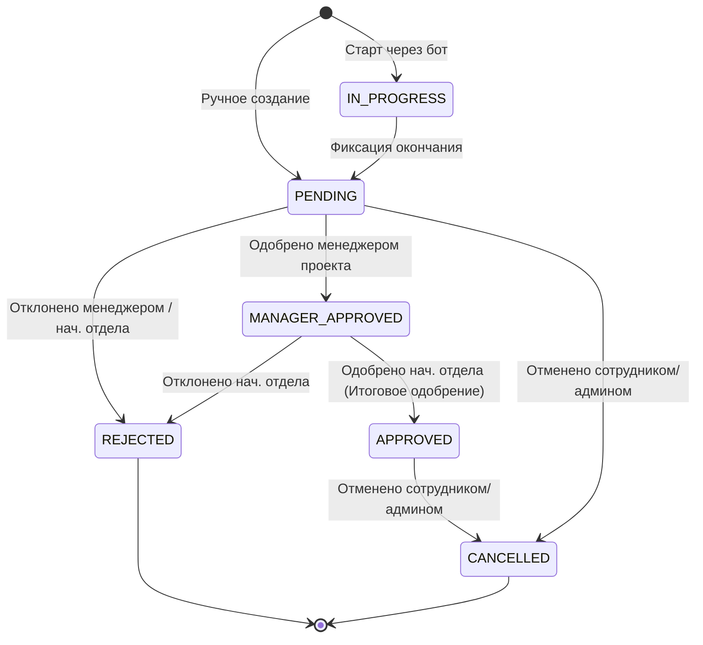

# Спецификация Бизнес-Требований (PRD) — Система OvertimePro

**OvertimePro** — это корпоративная система для автоматизации учета, согласования, контроля бюджетов времени и аналитики внеурочных работ (переработок) сотрудников. Система призвана сделать процесс согласования прозрачным, исключить бумажную волокиту и предоставить руководству аналитические инструменты для принятия решений.

Система поддерживает расширяемую архитектуру (Metadata-Driven), позволяющую добавлять динамические реквизиты к проектам и заявкам на переработку без изменения физической структуры базы данных.

---

## 1. Бизнес-Цели и Задачи

1.  **Прозрачный учет переработок**: Обеспечение возможности фиксации времени начала и окончания внеурочных работ (в том числе через Telegram-бот с геопозицией и голосовыми отчетами).
2.  **Двойное согласование (Workflow)**: Автоматизированный двухэтапный процесс утверждения заявок (сначала менеджером проекта, затем начальником отдела).
3.  **Гибкость мета-модели (Metadata-Driven)**: Аналитики и администраторы могут настраивать кастомные реквизиты для проектов и переработок (например, «причина переработки», «категория компенсации», «связанная задача в Jira») «на лету» с валидацией по динамическим схемам.
4.  **Аналитика и бюджетирование**: Мониторинг утилизации времени в разрезе отделов, проектов и конкретных сотрудников, контроль недельных лимитов переработок.
5.  **Экспорт данных**: Формирование детализированных отчетов в Excel с профессиональным оформлением и автоподсчетом сумм.

---

## 2. Ролевая Модель Доступа

Система разделяет права пользователей по следующим уровням (RBAC/ABAC):

*   **Сотрудник (User)**:
    *   Создает заявки на переработку (вручную или через Telegram-бот).
    *   Заполняет описание выполненных работ (включая загрузку голосовых сообщений).
    *   Просматривает личную историю и статистику переработок.
*   **Менеджер проекта (Manager)**:
    *   Видит заявки сотрудников по своим проектам.
    *   Одобряет (или отклоняет) первый этап согласования заявки (`manager_approved`).
    *   Просматривает отчеты по трудозатратам в рамках своих проектов.
*   **Начальник отдела (Head of Department)**:
    *   Видит заявки всех сотрудников своего отдела.
    *   Одобряет второй этап согласования заявки (`head_approved`).
    *   Контролирует общий бюджет времени отдела.
*   **Администратор (Admin)**:
    *   Управляет структурой организации (отделы, проекты, должности).
    *   Управляет пользователями и их ролями.
    *   Настраивает динамические мета-поля (`entity_definitions`) для переработок и проектов.
    *   Выгружает консолидированную отчетность компании.

---

## 3. Жизненный Цикл Заявки на Переработку (Overtime Workflow)

Заявка на переработку проходит следующие статусы (`OvertimeStatus`):

*   **IN_PROGRESS**: Сессия активна (сотрудник запустил таймер переработки через Telegram-бот).
*   **PENDING**: Заявка ожидает согласования руководителями.
*   **MANAGER_APPROVED**: Заявка одобрена менеджером проекта. Ожидает решения начальника отдела.
*   **APPROVED**: Финальное одобрение (оба руководителя подтвердили). Заявка учитывается в итоговом табеле.
*   **REJECTED**: Отклонено кем-либо из руководителей с обязательным указанием комментария.
*   **CANCELLED**: Отозвано сотрудником или отменено администратором.

---

## 4. Требования к Функциональным Модулям

### 4.1. Модуль Внеурочных Работ (Overtime Core)
*   Фиксация времени начала и конца переработки.
*   Привязка к проекту и автоматическое определение менеджера проекта для согласования.
*   Поддержка текстового описания работ.
*   Хранение динамических свойств в поле `data` типа `JSONB` с валидацией по схемам из `entity_definitions` (например, для добавления признака «Переработка в выходной день» или «Оплата по двойному тарифу»).

### 4.2. Модуль Интеграции с Telegram (Telegram Bot)
*   Авторизация сотрудника по Telegram-аккаунту (привязка `telegram_chat_id`).
*   Команды быстрого старта и стопа переработки (запуск таймера).
*   Передача геопозиции при старте/стопе переработки для контроля нахождения на рабочем месте.
*   Запись голосовых отчетов о проделанной работе с последующей автоматической транскрипцией текста с помощью библиотеки Whisper (ИИ-ассистент).

### 4.3. Модуль Интеграций (Microsoft & Odoo)
*   **Microsoft Office SSO / MS Graph**: Двухфакторная аутентификация через одноразовые коды (OTP) и интеграция с корпоративной почтой для отправки уведомлений о заявках.
*   **Odoo Integration**: Периодический импорт проектов и данных о пользователях из ERP-системы Odoo для поддержания актуальности реестра проектов.

### 4.4. Модуль Отчетов и Экспорта (Excel Export)
*   Генерация детализированных Excel-отчетов за выбранный период.
*   Форматирование ячеек, автовысота строк, жирные шрифты для итогов, автоматический расчет суммарных часов по проектам и отделам.
*   Фильтрация экспортируемых записей по статусам, проектам и отделам.

### 4.5. Модуль Мета-моделей (Metadata-Driven)
*   Возможность администратора через API создавать, редактировать и удалять описания кастомных полей (`entity_definitions`) для сущностей `Overtime` и `Project`.
*   Поддерживаемые типы данных: `string`, `number`, `boolean`, `date`, `select` (список опций).
*   Строгая проверка JSONB-полей перед сохранением заявок в базу данных.
