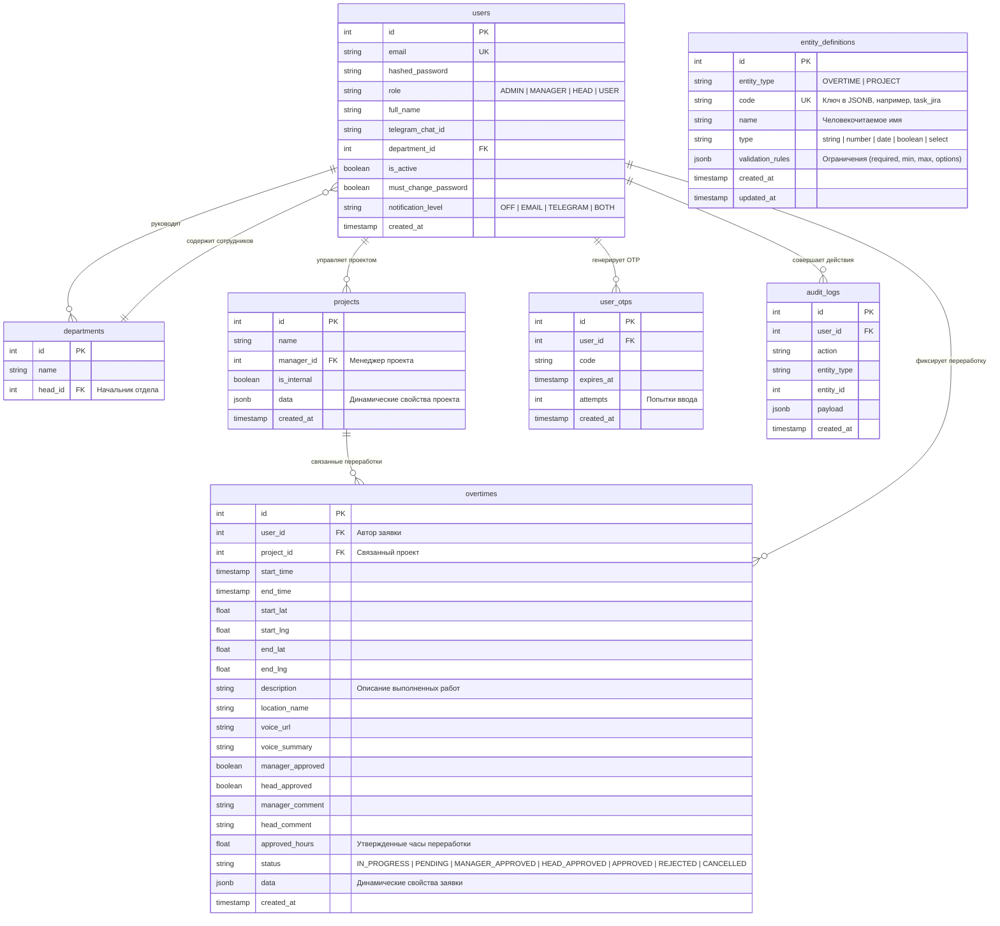

# Архитектура и Дизайн Системы OvertimePro (Python / FastAPI)

Этот документ описывает схему базы данных, структуру модулей бэкенда на Python/FastAPI, API-контракты, ключевые паттерны проектирования и меры безопасности системы учета и согласования переработок **OvertimePro** с поддержкой гибких динамических мета-моделей (Metadata-Driven Architecture).

---

## 1. Схема Базы Данных (PostgreSQL)

Схема данных спроектирована с учетом требований расширяемости. Сущности `overtimes` (переработки) и `projects` (проекты) содержат поле `data` типа `JSONB` для хранения кастомных полей, настраиваемых администраторами через таблицу `entity_definitions`.



### Индексы для оптимизации
*   `CREATE INDEX idx_overtimes_data_gin ON overtimes USING gin (data);` — GIN-индекс для быстрого поиска и фильтрации заявок по динамическим атрибутам.
*   `CREATE INDEX idx_projects_data_gin ON projects USING gin (data);` — GIN-индекс для кастомных свойств проектов.
*   `CREATE INDEX idx_overtimes_status ON overtimes (status);` — B-Tree индекс для быстрого получения списков на согласование.

---

## 2. Архитектурные Слои Бэкенда (Python/FastAPI)

Приложение спроектировано по принципу чистой многослойной архитектуры:

1.  **API Маршрутизаторы (`app/api/v1`)**:
    *   Прием HTTP-запросов, базовая Pydantic-валидация и вызов сервисов.
    *   Разграничение доступа с помощью FastAPI Dependency Injection (`get_current_user`, проверка ролей).
2.  **Службы / Сервисы (`app/services`)**:
    *   `OvertimeService` — создание, завершение сессий, расчет и округление часов, двухэтапное согласование.
    *   `DynamicValidationService` — проверка корректности данных в JSONB на основе записей `entity_definitions`.
    *   `NotificationService` — рассылка email и Telegram уведомлений.
    *   `ExcelReportService` — генерация Excel-таблиц.
3.  **Репозитории (`app/repositories`)**:
    *   Инкапсуляция сырых запросов SQLAlchemy.
4.  **Модели (`app/models`)**:
    *   Классы SQLAlchemy 2.0 с типизированными атрибутами `Mapped[...]` и `mapped_column()`.

---

## 3. Контракты API

Все API эндпоинты имеют префикс `/api/v1`.

### 3.1. Управление динамическими полями (`/api/v1/entity-definitions`)
*   `POST /` — Создать динамическое поле.
    *   *Request Body*:
        ```json
        {
          "entity_type": "OVERTIME",
          "code": "jira_ticket",
          "name": "Тикет в Jira",
          "type": "string",
          "validation_rules": {
            "required": true,
            "min_length": 3
          }
        }
        ```
*   `GET /:entity_type` — Получить список кастомных полей.
*   `DELETE /:id` — Удалить описание поля.

### 3.2. Заявки на переработку (`/api/v1/overtimes`)
*   `POST /start` — Начать сессию переработки (через Telegram-бот или веб-интерфейс). Фиксирует `start_time` и геопозицию.
    *   *Request Body*:
        ```json
        {
          "project_id": 5,
          "description": "Срочный фикс бага на проде",
          "start_lat": 43.238,
          "start_lng": 76.889,
          "data": {
            "jira_ticket": "PROD-123"
          }
        }
        ```
*   `POST /stop` — Завершить текущую сессию переработки. Фиксирует `end_time`, геопозицию, рассчитывает предварительную длительность.
*   `POST /` — Создать заявку вручную (за прошедший период).
*   `GET /` — Получить список переработок с фильтрацией (по статусу, проекту, периоду и динамическим полям в JSONB).

### 3.3. Процесс Согласования (`/api/v1/overtimes/:id/review`)
*   `POST /manager-approve` — Одобрение со стороны менеджера проекта. Переводит статус в `MANAGER_APPROVED` или `APPROVED` (если начальник отдела уже одобрил или лимит позволяет).
    *   *Request Body*:
        ```json
        {
          "approved": true,
          "comment": "Работы проверены, все ок."
        }
        ```
*   `POST /head-approve` — Одобрение со стороны начальника отдела.
*   `POST /reject` — Отклонение заявки (требуется обязательный `comment`). Статус становится `REJECTED`.

---

## 4. Ключевые Паттерны Проектирования

### 4.1. Безопасное Двухэтапное Согласование (Workflow)
Для исключения состояния гонки (race conditions) при параллельном согласовании (например, если менеджер проекта и начальник отдела одобряют заявку одновременно) используется пессимистическая блокировка строки `overtimes` с помощью `with_for_update()`.

```python
# app/services/overtime_review.py
from fastapi import HTTPException, status
from sqlalchemy.orm import Session
from sqlalchemy import select
from app.models.overtime import Overtime, OvertimeStatus

class OvertimeReviewService:
    @staticmethod
    async def approve_by_manager(db: Session, overtime_id: int, manager_id: int, comment: str) -> Overtime:
        """
        Проводит первый этап согласования менеджером проекта.
        Использует блокировку с FOR UPDATE для предотвращения race condition.
        """
        # Блокируем строку заявки на время выполнения транзакции
        stmt = select(Overtime).where(Overtime.id == overtime_id).with_for_update()
        result = db.execute(stmt)
        overtime = result.scalar_one_or_none()

        if not overtime:
            raise HTTPException(status_code=status.HTTP_404_NOT_FOUND, detail="Заявка не найдена")

        if overtime.status not in (OvertimeStatus.PENDING, OvertimeStatus.HEAD_APPROVED):
            raise HTTPException(
                status_code=status.HTTP_400_BAD_REQUEST, 
                detail="Заявка находится в несовместимом статусе для согласования"
            )

        overtime.manager_approved = True
        overtime.manager_comment = comment

        # Проверка итогового статуса
        if overtime.head_approved:
            overtime.status = OvertimeStatus.APPROVED
        else:
            overtime.status = OvertimeStatus.MANAGER_APPROVED

        db.commit()
        db.refresh(overtime)
        return overtime
```

### 4.2. Динамическая Валидация JSONB структуры
Перед сохранением или обновлением заявки `data` валидируется на основе активных правил для сущности `OVERTIME` из базы данных.

```python
# app/services/dynamic_validation.py
from typing import Dict, Any, List
from fastapi import HTTPException, status
from app.models.entity_definition import EntityDefinition

class DynamicValidationService:
    @staticmethod
    def validate(definitions: List[EntityDefinition], data: Dict[str, Any]) -> None:
        """
        Валидирует переданный JSONB-объект на соответствие динамическим правилам.
        """
        errors = []
        for field in definitions:
            value = data.get(field.code)
            rules = field.validation_rules or {}

            # Проверка обязательного заполнения
            if rules.get("required") and value is None:
                errors.append(f"Поле '{field.name}' ({field.code}) является обязательным.")
                continue

            if value is None:
                continue

            # Валидация типов
            if field.type == "string" and not isinstance(value, str):
                errors.append(f"Поле '{field.name}' должно быть строкой.")
            elif field.type == "number" and not isinstance(value, (int, float)):
                errors.append(f"Поле '{field.name}' должно быть числом.")
            elif field.type == "boolean" and not isinstance(value, bool):
                errors.append(f"Поле '{field.name}' должно быть логическим.")
            elif field.type == "select":
                options = rules.get("options", [])
                if value not in options:
                    errors.append(f"Значение '{value}' для поля '{field.name}' недопустимо.")

        if errors:
            raise HTTPException(
                status_code=status.HTTP_400_BAD_REQUEST,
                detail={"message": "Ошибка валидации кастомных полей", "errors": errors}
            )
```

### 4.3. Округление и Расчет Длительности
Бизнес-логика расчета переработанного времени (например, округление до ближайших 15 минут в пользу компании/сотрудника) выносится в единый утилитный метод, используемый как при отображении таймера, так и при сохранении итоговой записи.

```python
# app/core/utils.py
import math
from datetime import datetime

def calculate_overtime_hours(start_time: datetime, end_time: datetime) -> float:
    """
    Рассчитывает разницу во времени в часах с округлением до 0.25 часа (15 минут).
    """
    if not end_time or not start_time:
        return 0.0
    delta = end_time - start_time
    total_hours = max(0.0, delta.total_seconds() / 3600.0)
    # Округляем до ближайших 15 минут (0.25 часа)
    return round(total_hours * 4) / 4
```

---

## 5. Меры Безопасности и Устранение Уязвимостей (Security Hardening)

Для нейтрализации уязвимостей, описанных в `security_and_vulnerabilities_report.md`, архитектура включает следующие технические решения:

### 5.1. Безопасное управление JWT (XSS Mitigation)
*   **Access Token**: Переносится в in-memory state React-приложения. Он не записывается в `localStorage` или `sessionStorage`.
*   **Refresh Token**: Записывается бэкендом в защищенные cookie с флагами `HttpOnly` (недоступен для JS), `Secure` (передается только по HTTPS) и `SameSite="Lax"` (для бесконфликтной интеграции с SSO Authentik).
*   **Автообновление**: Фронтенд настраивает таймер на периодический фоновый запрос `/api/v1/auth/refresh` до истечения времени жизни access-токена.

### 5.2. Полноценное кэширование токенов MS Graph API
*   Внедрение паттерна Singleton для `ConfidentialClientApplication` (библиотека `msal`). Экземпляр создается один раз при старте сервиса `ms_graph.py` и повторно использует встроенный механизм `acquire_token_silent` с сериализацией кэша, исключая холостые HTTP-запросы к серверам Microsoft на каждое уведомление.

### 5.3. Защита от Brute-Force (Application-Level Rate Limiting)
*   Интеграция rate-limiting на уровне FastAPI с помощью библиотеки `slowapi` и бэкенда Redis.
*   Ограничение настраивается по ключу `email` или `username` (например, не более 5 попыток авторизации или верификации OTP за 10 минут) для противодействия распределенным атакам методом перебора с использованием резидентских прокси.

### 5.4. Динамическая настройка часовых поясов
*   Использование системной настройки `Settings.DEFAULT_TIMEZONE` (по умолчанию `Asia/Almaty`), вынесенной в переменные окружения.
*   Каждому пользователю в таблице `users` добавляется опциональное поле `timezone`. Сервис отправки уведомлений и отображения дат в боте адаптирует часовой пояс под конкретного получателя с нормализацией через библиотеку `pytz`.

### 5.5. Безопасная инициализация скрипта `create_admin.py`
*   Отказ от захардкоженного пароля `"admin"`.
*   Скрипт использует криптостойкий генератор `secrets.token_urlsafe()` для создания уникального случайного пароля.
*   Сгенерированный пароль выводится в консоль один раз при создании.
*   Пользователь создается со значением `must_change_password=True`, обязывающим сменить пароль при первом входе.

### 5.6. Безопасное сравнение datetime
*   Сравнение срока действия токена в сервисах нормализует все входящие объекты datetime к timezone-aware UTC:
    ```python
    expires_at = db_token.expires_at
    if expires_at.tzinfo is None:
        expires_at = expires_at.replace(tzinfo=timezone.utc)
    ```
    Это предотвращает выброс исключения `TypeError` при неявном приведении СУБД типов дат.

### 5.7. Локализация статических ресурсов UI
*   Все внешние фоновые изображения (включая фон экрана входа из `images.unsplash.com`) переносятся в директорию `frontend/public/assets/` и загружаются локально для стабильной работы интерфейса в изолированных корпоративных контурах.

### 5.8. Отказ от сырого SQL в сортировках
*   Замена небезопасных конструкций `text("total_hours DESC")` на встроенные методы ORM:
    ```python
    from sqlalchemy import desc
    query = query.order_by(desc(total_hours_column))
    ```
    Это гарантирует защиту от потенциальных инъекций и обеспечивает совместимость с различными СУБД.
