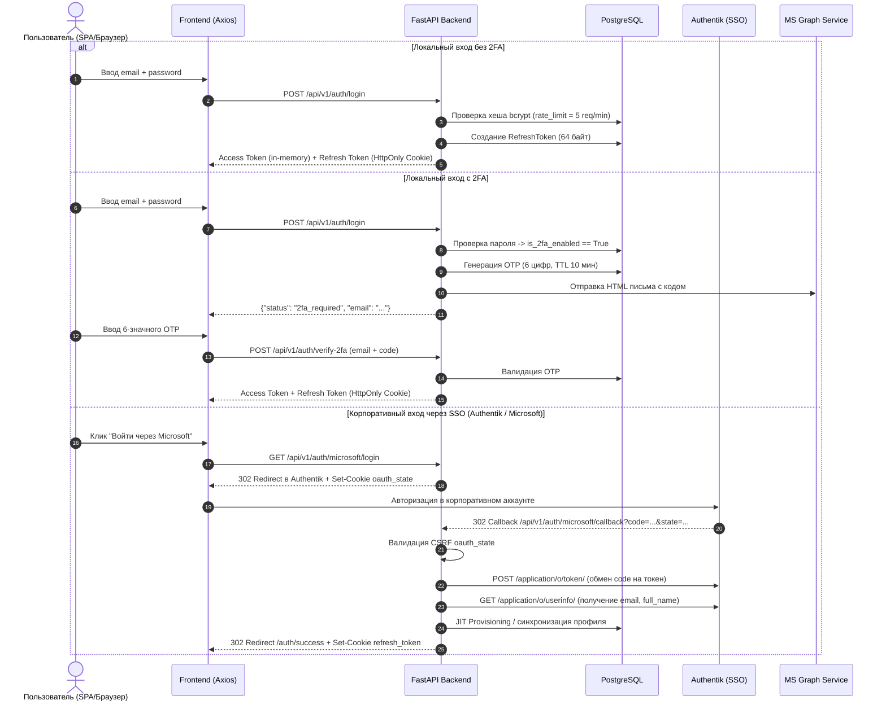

# Техническое задание и Спецификация: Модуль Аутентификации и Авторизации (Auth & SSO)

## 1. Введение и Назначение
Настоящий документ содержит детальные технические требования и архитектурное описание подсистемы идентификации, аутентификации, авторизации и управления сессиями пользователей в рамках корпоративной системы **OvertimePro**.

### 1.1. Цели модуля
* **Безопасность**: Защита от векторов атак XSS, CSRF, Brute-force, Session Hijacking и Token Replay.
* **Единый вход (SSO)**: Поддержка корпоративной федеративной аутентификации на базе протокола **OpenID Connect (OIDC / OAuth2)** через шлюз Authentik / Microsoft Entra ID.
* **Гибкость входа**: Возможность локального входа по связке `Email + Пароль` с поддержкой **2FA (Email OTP)**.
* **Ролевое разграничение (RBAC)**: Дифференциация уровней доступа согласно иерархии ролей (`employee`, `manager`, `head`, `admin`).
* **Аудит безопасности**: Протоколирование всех событий входа, смены паролей и изменения параметров безопасности в `audit_logs`.

---

## 2. Архитектурная модель и Data Flow



---

## 3. Спецификация API Эндпоинтов

### 3.1. Локальная аутентификация и 2FA

#### `POST /api/v1/auth/login`
* **Назначение**: Первичная аутентификация по логину (Email) и паролю.
* **Content-Type**: `application/x-www-form-urlencoded` (`OAuth2PasswordRequestForm`).
* **Ограничение частоты**: `login_limiter` (максимум 5 запросов в минуту на email).
* **Сценарии ответа**:
  * **200 OK**:
    ```json
    {
      "status": "success",
      "access_token": "eyJhbGciOi...",
      "token_type": "bearer",
      "user": {
        "id": 1,
        "email": "admin@example.com",
        "full_name": "Администратор",
        "role": "admin",
        "company": "Polymedia",
        "is_active": true,
        "is_2fa_enabled": false
      }
    }
    ```
    *Заголовок ответа*: `Set-Cookie: refresh_token=...; HttpOnly; Secure; SameSite=Lax; Max-Age=2592000`
  * **200 OK (2FA Required)**:
    ```json
    {
      "status": "2fa_required",
      "email": "admin@example.com"
    }
    ```
  * **400 Bad Request**: Неверный логин/пароль или аккаунт настроен только для входа через SSO.
  * **403 Forbidden**: Учетная запись деактивирована (`is_active = false`).
  * **429 Too Many Requests**: Превышен лимит попыток входа.

#### `POST /api/v1/auth/verify-2fa`
* **Назначение**: Подтверждение входа одноразовым кодом при включенной 2FA.
* **Request Body**:
  ```json
  {
    "email": "admin@example.com",
    "code": "123456"
  }
  ```
* **Ответ**: идентичен успешному `POST /api/v1/auth/login`.

---

### 3.2. Ротация токенов и поддержание сессий

#### `POST /api/v1/auth/refresh`
* **Назначение**: Бесшовное продление сессии и получение нового короткоживущего `access_token`.
* **Аутентификация**: Наличие валидного `refresh_token` в `Cookie`.
* **Token Rotation**:
  * Старый refresh-токен помечается в базе как `revoked = True`.
  * Генерируется и записывается новый refresh-токен.
  * В `Set-Cookie` отдается обновленный токен.
* **Reuse Detection (Защита от кражи сессии)**:
  * Если получен токен со статусом `revoked = True`, система инициирует отзыв всех токенов данного `user_id` и возвращает `401 Unauthorized` ("Сессия скомпрометирована").
* **Grace Period**: Внутренний кэш на 10 секунд с `asyncio.Event` блокировкой для параллельных запросов из одного браузера.

#### `POST /api/v1/auth/logout`
* **Назначение**: Завершение пользовательской сессии.
* **Действия**: Инвалидация refresh-токена в базе данных, очистка сессионной куки через `delete_cookie("refresh_token")`.

---

### 3.3. SSO OpenID Connect (Authentik / Microsoft)

#### `GET /api/v1/auth/microsoft/login`
* **Назначение**: Старт OIDC Flow.
* **Параметры**:
  * `client_id`, `redirect_uri`, `response_type=code`, `scope=openid email profile`, `prompt=select_account`, `state=<random_32_bytes>`.
* **Cookie**: `Set-Cookie: oauth_state=<state>; HttpOnly; SameSite=Lax; Max-Age=900`.

#### `GET /api/v1/auth/microsoft/callback`
* **Назначение**: Callback endpoint для обработки авторизационного кода.
* **Параметры URL**: `code`, `state`.
* **Логика**:
  1. Сравнение `state` из URL с `oauth_state` из Cookie (защита от CSRF).
  2. Запрос токенов на `/application/o/token/`.
  3. Запрос профиля на `/application/o/userinfo/`.
  4. Автоматическая привязка к компании:
     * Если `@aj-tech` / `@ajtech` в email $\rightarrow$ `UserCompany.AJ_techCom`
     * Иначе $\rightarrow$ `UserCompany.Polymedia`
  5. Снятие флага `must_change_password` (при наличии).
  6. Выпуск `refresh_token` и 302 Redirect на фронтенд (`${FRONTEND_BASE_URL}/auth/success`).

---

### 3.4. Профиль, Смена и Восстановление пароля

#### `GET /api/v1/auth/me`
* **Заголовок**: `Authorization: Bearer <access_token>`
* **Ответ**: Данные текущего авторизованного пользователя.

#### `POST /api/v1/auth/change-password`
* **Назначение**: Смена пароля аутентифицированным пользователем.
* **Request Body**: `{"old_password": "...", "new_password": "..."}`.
* **Логика**: Проверка старого пароля, хеширование нового через bcrypt, снятие флага `must_change_password = False`, фиксация события в аудит-логе.

#### `POST /api/v1/auth/password-reset/request`
* **Request Body**: `{"email": "admin@example.com"}`.
* **Логика**: Генерация 6-значного OTP типа `password_reset`, отправка через почтовый сервис.

#### `POST /api/v1/auth/password-reset/confirm`
* **Request Body**: `{"email": "admin@example.com", "code": "123456", "new_password": "..."}`.
* **Логика**: Проверка кода, обновление хеша пароля в БД.

---

## 4. Спецификация моделей данных (PostgreSQL)

### 4.1. Таблица `users`
* `id` (Integer, PK)
* `email` (String, Unique, Indexed)
* `full_name` (String)
* `hashed_password` (String)
* `role` (Enum: `employee`, `manager`, `head`, `admin`)
* `company` (Enum: `Polymedia`, `AJ-techCom`)
* `department_id` (Integer, FK -> `departments.id`, Nullable)
* `is_active` (Boolean, default: `true`)
* `must_change_password` (Boolean, default: `false`)
* `is_2fa_enabled` (Boolean, default: `false`)
* `telegram_chat_id` (String, Nullable)
* `notification_level` (Integer, default: 2)
* `created_at`, `updated_at` (DateTime with timezone)

### 4.2. Таблица `refresh_tokens`
* `id` (Integer, PK)
* `user_id` (Integer, FK -> `users.id` on delete CASCADE)
* `token` (String, Unique, Indexed)
* `expires_at` (DateTime with timezone)
* `revoked` (Boolean, default: `false`)
* `created_at` (DateTime with timezone)

### 4.3. Таблица `user_otps`
* `id` (Integer, PK)
* `user_id` (Integer, FK -> `users.id` on delete CASCADE)
* `code` (String(6))
* `type` (Enum: `login`, `password_reset`)
* `expires_at` (DateTime with timezone)
* `attempts` (Integer, default: 0)
* `created_at` (DateTime with timezone)

---

## 5. Матрица Безопасности и Меры Защиты

| Угроза / Вектор атаки | Архитектурное решение |
| :--- | :--- |
| **XSS (Cross-Site Scripting)** | Access Token хранится только в JavaScript памяти (in-memory). Сессионный Refresh Token изолирован в `HttpOnly` Cookie и недоступен скриптам. |
| **CSRF (Cross-Site Request Forgery)** | Cookie настроены с директивой `SameSite=Lax`. OIDC Authorization flow защищен одноразовым криптографическим токеном `oauth_state` в отдельной куке. |
| **Кража Refresh токена (Token Hijacking)** | Ротация токенов (Token Rotation) с детекцией повторного использования (Token Reuse Detection): повторное предъявление отозванного токена аннулирует все сессии учетной записи. |
| **Подбор паролей и OTP (Brute-Force)** | Лимитирование запросов `LoginRateLimiter` (5 попыток в минуту) + счетчик неверных попыток ввода OTP в базе. |
| **Несанкционированные действия при обязательной смене пароля** | Middleware/Dependency `get_current_user` перехватывает запросы при `must_change_password=True` и блокирует доступ ко всем ресурсам, кроме профиля и смены пароля. |
